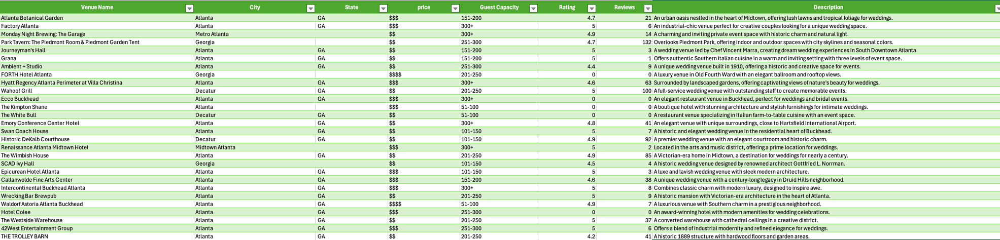

# Web Scraping Tool

This project is a web scraping tool developed using **Crawl4AI**, **Groq**, and **DeepSeek**. The tool is designed to extract structured data, particularly focused on wedding venue details. The extracted data is stored in a CSV format for further analysis and visualization.

## Project Structure

```
Web_Scraping_DeepSeek/
├── .venv/                # Python virtual environment
├── models/               # Data models
│   ├── __init__.py
│   └── venue.py          # Venue model
├── utils/                # Utility scripts
│   ├── __init__.py
│   ├── data_utils.py     # Data processing utilities
│   └── scraper_utils.py  # Scraper configuration and setup
├── .env                  # Environment variables (API keys, configs)
├── config.py             # Configuration file
├── main.py               # Entry point for running the scraper
├── complete_venues.csv   # Output file containing extracted venue details
├── README.md             # Documentation
├── requirements.txt      # Python dependencies
└── .gitignore            # Git ignore file
```

## Features

- **Web Scraping:** Extracts wedding venue details like name, location, price, capacity, rating, reviews, and descriptions.
- **Language Model Integration:** Utilizes **Groq** and **DeepSeek** to enhance data extraction using AI-driven techniques.
- **Configurable:** Customizable scraping strategies, including browser settings and language model configuration.
- **Data Validation:** Ensures data completeness and removes duplicates before saving.
- **Output:** Saves the extracted data into a structured CSV file for further analysis.
- **Excel Conversion:** Please open an excel file. Go to data tab and click on get data(Power Query). Select from file and select the csv file. Click on transform make some correction and load the data for further analysis.


## Installation

1. Clone the repository:
   ```bash
   git clone https://github.com/yourusername/Web_Scraping_DeepSeek.git
   cd Web_Scraping_DeepSeek
   ```

2. Set up the virtual environment:
   ```bash
   python3 -m venv .venv
   source .venv/bin/activate  # On Windows: .venv\Scripts\activate
   ```

3. Install dependencies:
   ```bash
   pip install -r requirements.txt
   ```

4. Configure environment variables:
   - Create a `.env` file in the root directory.
   - Add the following variables:
     ```env
     GROQ_API_KEY=your_api_key
     ```

## Usage

1. Run the main script:
   ```bash
   python main.py
   ```

2. The extracted data will be saved in `complete_venues.csv`.

## Configuration

### Browser Configuration
The `get_browser_config()` function in `scraper_utils.py` allows you to configure the browser settings for the scraper. Example:
```python
return BrowserConfig(
    browser="play-chromium",  # Type of browser
    headless=False,           # Run browser in headless mode
    verbose=True              # Enable verbose logging
)
```

### Language Model Strategy
The `get_llm_strategy()` function defines how the language model is used for data extraction. Example:
```python
return LLMExtractionStrategy(
    provider="groq/deepseek-ll-distill-Llama-7b",  # LLM provider
    api_token=os.getenv("GROQ_API_KEY"),          # API authentication
    schema=Venue.model_json_schema(),              # JSON schema of the data model
    extraction_type="schema",                     # Extraction type
    instructions="Extract all venue objects...",  # Instructions for the model
    input_format="markdown",
    verbose=True
)
```

## File Descriptions

- `venue.py`: Defines the `Venue` model used to validate and structure data.
- `data_utils.py`: Contains utility functions like `is_duplicate_venue`, `is_complete_venue`, and `save_venues_to_csv`.
- `scraper_utils.py`: Manages browser and language model configurations.
- `complete_venues.csv`: Output file containing the scraped data.

## Example Output

The output CSV file includes the following columns:
- `name`
- `location`
- `price`
- `capacity`
- `rating`
- `reviews`
- `description`

## Future Enhancements

- Add support for additional data sources.
- Integrate advanced error handling and retry mechanisms.
- Develop a user interface for non-technical users.
- Support for exporting data in additional formats (e.g., JSON, Excel).

## Dependencies

- Crawl4AI==0.4.247
- python-dotenv
- pydantic==2.10.6

## Contributing

Contributions are welcome! Please fork the repository and submit a pull request.

## Contact

For questions or support, feel free to reach out to biswas.shaon@gmail.com.
